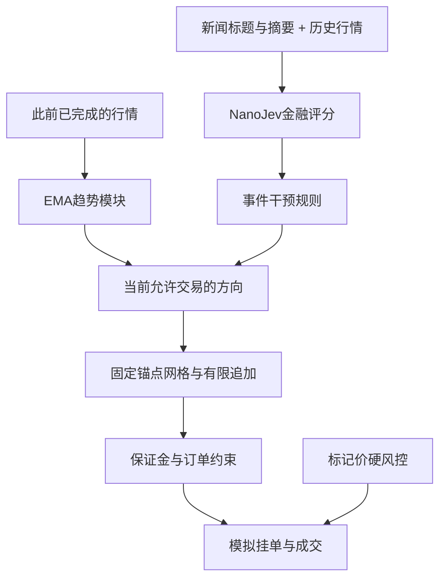

# 方案记录：FMZ-JEV-20260923-R1

记录日期：2026-09-23。候选编号：1623。原始冻结时间与文件哈希见[selection_freeze.json](../../reports/fmz_v2/selection_freeze.json)。本次文档化不重新选择参数、不改写已完成回测结果。

## 目标、范围与状态

研究BTCUSDT USDT本位永续合约：用100 USDT初始总权益、配置杠杆最高10倍，保留原FMZ双向网格与有限马丁追加，加入NanoJev事件干预及止盈后的趋势控制。模拟包含手续费、资金费、滑点、订单档位、保证金约束、止损和爆仓，不补入资金。

选中版本有基础成本下的历史正收益证据；尚无稳健实盘盈利证据。用户原先考虑的“双边全平、暂停网格”已作为模式1实现和搜索，但最终选中的是模式2“方向过滤与反向退出”。两者不能混称。

所有运行使用原生Windows Python/Node；禁止Docker、WSL和其他OS虚拟化环境。没有真实账户下单接口。

## 来源与已做的适配

原FMZ导出实际回测配置为ARB_USDT、5000U、20倍杠杆，默认参数含30倍杠杆。原文件SHA256：`8000bfb7b97f7b4c68320d631b5a73ec11cc58939e2addc5a9a3ec73078a60d5`。

保留固定首次开仓锚点、线性网格距离、未取整数量递增、分侧均价止盈、对侧层数限制及单侧名义额上限。修正BTC数量精度、多空间距相互覆盖、拒单推进层数、退出后沿用旧状态、非对称72小时休眠和权益口径问题。已持仓与双方下一层挂单一起占用保证金预算，挂单、成交和重开阶段均检查。

原码重启后缺失锚点等缺陷已复现；本次回测从空仓初始化，未实现生产环境的持仓恢复和持久化。详情见[源码审查](../../reports/fmz_v2/source_review/review_zh.md)。

## 冻结参数与单位

完整机器可读配置以[final_parameters.json](../../reports/fmz_v2/final_parameters.json)为准，SHA256：`5d32d17111996935af6b4b10c595eb4b112da85e77848118d8b5023176cf52a0`。

| 部分 | 冻结值 | 实际含义 |
| --- | --- | --- |
| 初始权益 | 100 USDT | 多空共享整个账户，无中途入金 |
| 杠杆/额度 | 10倍 / 70% | 新增持仓与挂单合计受当时权益×10×0.7约束 |
| 网格间距 | 3.5% | 每侧首次开仓价×3.5%形成固定价差 |
| 数量递增 | 1.1；最多追加5次 | 单侧最多首单加5次追加，实际数量受0.001 BTC档位影响 |
| 基础金额 | max(权益×3%, 30U) | 首单目标再乘1.1，随后满足最小名义额及数量步长 |
| 止盈距离 | 1.75% | 持仓均价±刷新时现价×1.75%，非账户利润率 |
| 对侧层数限制 | 99 | 相对最多5次追加，本版基本不靠此项阻止重开 |
| 单侧名义额上限 | 初始资金×5 = 500U | 原码maxLoss的实际语义；并非最多亏损500U |
| 趋势判断 | EMA120/EMA240分钟 | 使用此前完整分钟，进入相对差0.3%，收盘方向一致 |
| 趋势确认/维持 | 60分钟 / 进入阈值×0.3 | 维持阈值为0.09%，变化也按确认规则处理 |
| 反向仓位 | 确认趋势后关闭 | 取消逆势追加，禁止逆势开新仓 |
| 趋势仓止损/跟踪退出 | 均价1% / 最佳标记价回撤7% | 只有相应方向状态下的仓位适用 |
| 周期/账户风险 | 周期亏损60%；峰值回撤25%停机 | 硬风险独立于JEV；跳空可穿越阈值 |
| 退出/报价等待 | 风险退出冷却0分钟；止盈重开30秒；成交后报价1秒 | 三个不同计时器，不混用 |
| JEV | 模式2；突破分数0.25；方向偏向0.1；保持180秒 | 具体映射见[JEV说明](jev_role.md) |
| 新闻延迟 | 可用时间后5秒 | 回溯假设，未取得历史真实接收日志 |
| 成交成本 | Maker 0.02%；Taker 0.05%；市价滑点2bp | 立即可成交的新限价单按Taker处理 |
| 强平 | 维持保证金率0.4%；模拟强平费1.25% | 多空名义额相加；强平后停机、不补钱 |

## 决策流程与模块分工

1. 每秒结算当期资金费并检查持仓风险；技术控制器只读取此前完成分钟的特征。
2. 中性状态建立多空两侧，每侧维护独立锚点、下一层报价及整侧止盈。首单、后续追加及重新开仓都可能被预算阻止。
3. 一侧止盈后，若相应趋势持续确认，则切入方向状态，按配置关闭反向持仓；重开顺势仓还需新闻规则和保证金允许。进入方向状态后，趋势维持、退出及反转按EMA迟滞与确认规则更新。
4. JEV对加仓/重开作额外限制；方向偏向达到阈值时可平掉反向仓。它不会让被技术趋势或硬风险禁止的订单获得开仓许可。
5. 保留仓位的正常止盈、名义上限、权益止损和强平检查独立执行。持仓完全退出后只在条件重新满足时恢复；账户回撤停机或爆仓后不再恢复。

“秒级”是回放和事件决策频率。30秒模型标签、180秒事件保持和60分钟趋势确认分别服务不同目的；不能把它们描述为经过验证的同一个预测时间范围。

## 研究过程与采用理由

| 记录 | 做法 | 结论 |
| --- | --- | --- |
| 源码重建 | 按用户实际FMZ固定锚点结构重建 | 与上一轮以上一笔价格为中心的策略区分 |
| 广泛搜索 | 固定种子20260924，3000组不同参数，五个控制族 | 3—6月初筛；7—8月参与验证和选参 |
| 秒级复核 | 10个候选分别检查3—6月和7—8月 | 淘汰分钟盈利但秒级失效的候选 |
| 首次冻结 | 两段正收益、无停机/爆仓、发生真实模拟追加；按收益与回撤评分选1623 | 本版保留该参数，不因后续对照更好而替换 |
| 全期及对照 | 单一100U账户、205天、固定参数 | 得到历史正收益；趋势反向退出改变结果 |
| 费用与延迟压力 | 提高成本、移动新闻到达时间、改变报价等待及OHLC顺序 | 发现高成本和60秒消息延迟会转亏 |
| 高成本复筛 | 对7个基础成本合格候选，要求两段均承受费用加倍且滑点10bp | 0个通过，未找到相应稳健解 |
| 新闻规则对照 | 关闭方向评分、每条新闻固定暂停 | 没有证明JEV优于简单新闻暂停规则 |

前几次搜索是同一候选池在撮合修正后的重跑，不计成更多独立参数。最终有效记录为[search_margin_verified](../../reports/fmz_v2/search_margin_verified/search_protocol.json)。9月此前已经在项目研究中看过，本轮即使未用9月收益排名，也不能称其为全新未见样本。模型训练使用3—5月、选择与校准使用6月，3—6月回测包含样本内研究。

## 结果与反证

| 固定参数场景 | 净收益 | 最大回撤 | 说明 |
| --- | --- | --- | --- |
| 主方案，全期连续账户 | +72.6141% | 17.0864% | 100U → 172.6141U；爆仓0次 |
| 同参数关闭JEV | −7.5404% | 25.1764% | 触发账户回撤停机 |
| 同参数关闭趋势控制 | +1.9848% | 25.2699% | 触发账户回撤停机 |
| 同参数不关闭反向仓 | −9.4056% | 25.2034% | 触发账户回撤停机 |
| 原结构BTC安全适配基线 | −24.9880% | 38.7312% | 基线使用自己的原结构参数，非单变量对照 |
| 保留JEV触发，关闭其方向作用 | +75.5829% | 16.7330% | 方向规则在此样本没有带来收益提升 |
| 每条新闻固定暂停 | +87.7577% | 16.7320% | 简单规则超过JEV主方案 |
| 费用加倍且滑点10bp | −21.5321% | 25.6192% | 成本压力失败 |
| 新闻延迟60秒 | −22.0558% | 25.2317% | 时序压力失败 |

主方案手续费25.4605U，净资金费−0.6333U；80次追加、164次止盈、30次趋势驱动反向平仓、1次JEV方向平仓。连续账户9月1—21日损益−3.6484U；独立100U从9月开始回放为+7.5006%，两种口径的期初仓位和资金不同，不能混用。

## 采用、否决与未完成事项

- **保留**：固定锚点网格、止盈后趋势确认、主动退出反向仓、独立硬风控以及可关闭的JEV模块。
- **作为研究参数保留**：候选1623及全部对照。+72.61%不代表未来收益承诺。
- **未采用为最终配置**：新闻触发就双边全平的模式1候选；它未通过两段秒级筛选。
- **证据不支持**：把原始NanoJev当作现成金融模型；把高分类准确率当作胜率；把收益全归因于新闻理解；宣称历史无爆仓即未来不会爆仓。
- **尚未完成**：真实接收时间消息流、多来源事件覆盖、盘口排队与部分成交、交易所执行适配、持仓恢复、独立前瞻验证。现有程序属于研究模拟。

秒级标记价采用上一完整分钟基差估计，另用官方分钟标记价检查；新闻文本为事后取得的出版/修改时间代理。全期收益也包含模型和参数的研究选择，不能据此估计可靠未来期望收益。样本重采样仅作为条件情景，详见[完整报告](../../reports/fmz_v2/final_report_zh.md)。

## 后续版本的验收条件

新版本应保留本版记录，使用新编号记录修改原因、数据时间和所有对照。只有在同等成本、相同消息时间口径下，JEV持续超过“每条新闻固定暂停”和关闭JEV的基线，并通过成本/时序压力与独立前瞻模拟，才可上调对模型增量价值的判断。未来若研究“是否应弃仓”，需要让模型输入包括真实持仓风险，并训练继续持有/停止加仓/平仓等动作的结果标签；当前30秒价格分类头尚未完成这一目标。
