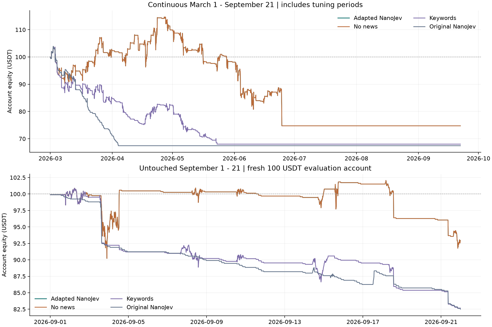

# BTC/USDT 永续：NanoJev 双向马丁网格回测与调优报告

**结论：程序及回测已实现；当前结果未达到实盘部署条件。** 本次交付的是可以复现的研究结果，参数是本次有限搜索中按既定评分选出的配置，不代表全局最优或未来收益承诺。

初始资金为整个账户合计 **100 USDT**，杠杆最多 **10 倍**。币种为 Binance USDⓈ-M BTCUSDT 永续，采用全仓式账户权益模拟，同时持有独立多、空两侧库存。事件弃仓的含义严格为：**停止新开仓和加仓、清理挂单、两侧全部平掉、暂停网格**。

这里的“秒级”指1秒行情回放与事件决策处理，模型预测未来30秒；不代表每笔交易都在几秒内结束。成本约束下选出的网格较宽，最大一轮持仓为48小时。如果目标是每笔几秒内完成开平，本次结果不能支持这种收益预期。

## 1. 最重要的实际结果

- 2026-03-01 至 2026-09-21 连续账户：最终 **74.73U**，净收益 **-25.27U / -25.27%**，最大回撤 **35.33%**，模拟爆仓 **0 次**。
- 9月1日至21日独立留出测试：重新以 100U 启动，最终 **92.39U**，净收益 **-7.61U / -7.61%**，最大回撤 **12.86%**，模拟爆仓 **0 次**。
- 同一组网格参数下，NanoJev 对9月最终权益的增量为 **+0.00U**，比较对象为不使用新闻的网格。这是一次历史对照差值，不能解释为因果贡献。
- 全期含有训练与调参月份，不能称为样本外收益；9月独立账户也不能与全期连续账户的9月损益混用。
- 数据截点为 **2026-09-22 00:00 UTC**。9月22日至30日不在这份完成日回测中，未补写未来收益。

| 方案（同一组网格参数） | 全期最终权益 U | 全期净收益 | 9月最终权益 U | 9月净收益 | 9月最大回撤 | 9月爆仓 |
| --- | --- | --- | --- | --- | --- | --- |
| 金融适配 NanoJev | 74.73 | -25.27% | 92.39 | -7.61% | 12.86% | 0 |
| 同参数、不使用新闻 | 74.73 | -25.27% | 92.39 | -7.61% | 12.86% | 0 |
| 固定关键词熔断 | 68.02 | -31.98% | 82.55 | -17.45% | 18.57% | 0 |
| 原始游戏 NanoJev | 67.45 | -32.55% | 82.38 | -17.62% | 17.64% | 0 |

| 区间 | 净收益 U | 手续费 U（已计入净收益） | 净资金费 U | 成交笔数 | 马丁加仓次数 | 事件弃仓次数 |
| --- | --- | --- | --- | --- | --- | --- |
| 全期连续账户 | -25.27 | 36.29 | -0.3525 | 584 | 94 | 0 |
| 9月独立留出账户 | -7.61 | 4.17 | +0.0068 | 86 | 12 | 0 |

全期连续账户在6月已触发永久回撤停机，7—9月权益保持不变。独立9月测试是为了检验冻结参数在新时段的行为，使用新的100U模拟账户，**不等于给已停机的连续账户补资再交易**。

**是否真的使用了事件弃仓：** 最终搜索主配置在全期触发0次、9月触发0次事件弃仓；阈值过高导致不介入时，与不使用新闻相同，不能将此算作模型贡献。为真正评估“Jev决定弃仓”，另在看9月结果前冻结了有实际事件干预的最佳验证候选，文件为`active_event_parameters.json`。该候选事件阈值为0.4，全期最终权益 **72.09U**、9月最终权益 **85.44U**，分别触发4和3次事件弃仓。它的其他网格参数也不同，不能直接与主配置作因果比较。对它再做同参数、不使用新闻的独立对照，9月最终权益为 **86.26U**，事件干预对应历史差值 **-0.82U**。

## 2. 最终冻结参数

| 参数 | 值与含义 |
| --- | --- |
| 初始总账户资金 | 100 USDT；无追加保证金 |
| 杠杆 | 10 倍，硬上限 10 倍 |
| 总仓位预算比例 | 60% × 当前权益 × 杠杆（多空名义额相加） |
| 每侧初始目标名义额 | 50 USDT；仍需按最小量和金额向上取整 |
| 马丁倍数 / 每侧最多追加层数 | 1.5 / 4 |
| 相邻加仓距离 | 1.8% |
| 每侧平均成本止盈距离 | 2.7% |
| 整篮止损 / 止盈 | 18% / 2.5%（相对该轮初始权益） |
| 最大一轮时长 | 2880 分钟 |
| 清仓后冷却 | 180 分钟 |
| 账户最高权益回撤永久停机 | 35%（成交费用和跳空可使实际损失超过阈值） |
| 事件熔断阈值 | P(上涨或下跌越过阈值) ≥ 0.5 |
| 事件阻止开仓时长 | 15 分钟；已有仓位清仓还受一般冷却限制 |
| 基准新闻延迟假设 | 5 秒，从出版/修改时间代理起算 |
| 价格闸门 | 近5分钟绝对变化 > 2%，或已完成15分钟振幅 > 1.5% |
| Maker / Taker 手续费假设 | 0.02% / 0.05%；不含任何返佣或 VIP 折扣 |
| 市价单额外滑点 | 2 bps；1 bps=0.01% |
| 维持保证金率 / 模拟强平费 | 0.4% / 1.25% |
| 数量步长 / 价格步长 | 0.001 BTC / 0.10 USDT |
| 历史开仓最小名义额 | 100U；2026-04-14 10:30 UTC 起保守采用 50U |

可机读参数文件：`final_parameters.json`。冻结时间 `2026-09-22T20:05:03.763820+00:00`，参数 SHA256：`380d7799d7cab6fc5b66cbfc1da1cbe6ce2c4f72178af044a335d4c92201f1b6`。任何重新选择参数的行为都会使当前9月测试失去“未参与选择”的含义。

100U 并不等于每侧都有100U保证金。例如币价60,000U且最小名义额100U时，每侧至少0.002 BTC，即120U；若下一层倍数1.5，则该层至少0.003 BTC，即180U。两侧起始仓加一层已经需要420U总名义额。层数只表示上限，保证金检查可能提前拒绝加仓，绝不会假定额外入金。

## 3. 调优方法与防止未来信息进入决策

使用固定随机种子20260923。前两次各300组探索用于检查成交模型和可执行性，并保存在 preliminary 目录；其中发现无法支付马丁加仓的“低活动”参数和分钟标签不适合秒级目标。最终使用未来30秒标签，并对 **300 组可负担起始双边仓位及至少一层加仓的参数** 做正式搜索。探索历史属于同一研究过程，不能当作完全未尝试过的新策略。

1. 3—5月：冻结 NanoJev 骨干，只训练原有选择决策头。
2. 6月1—15日：选择决策头训练超参数与停止轮次；6月16—30日：温度校准。
3. 3—6月：策略参数用1分钟行情初筛；7—8月做独立时间段验证。
4. 前10组候选在7—8月 **1秒成交行情** 上复核，以同一个风险调整评分选择最后参数。评分为“收益百分点 − 0.75×最大回撤百分点 − 停机惩罚10”，并要求实际成交、实际加仓且未爆仓。
5. 冻结参数、模型与引擎哈希后，才执行9月策略收益测试。正式选中试验编号为 `59`；其7—8月1秒验证收益 **-3.03%**。

并未声称整段3—9月均为逐期滚动样本外测试。早期模型拟合数据与策略训练数据重叠，属明确的样本内研究；9月只有21天，统计证据很有限。

## 4. 新闻与价格数据

- **成交数据**：Binance 官方公开期货归档，205天、293,759,548笔聚合成交，生成17,712,000根1秒K线；原始压缩成交数据约3.58GB，保留校验收据。
- **分钟成交价与标记价**：295,200根，覆盖完整205天；发现并用日归档补回6月29日的月归档缺口。
- **资金费**：3—8月官方归档，9月通过公开期货REST接口补齐，按真实时间和费率结算。未使用固定资金费替代缺失记录。
- **新闻**：Bitcoin Magazine公开WordPress接口共983条，能构造完整行情输入及标签的976条。保留URL、原题、摘要、出版和修改时间、获取时间。当前实验只有一个媒体源；不声称覆盖全部宏观、交易所、社交媒体或突发消息。
- **无成交秒**：891,732秒沿用此前已知成交价，成交量为0，不使用未来成交回填。与独立1分钟归档比对，分钟收盘价超过一档价格差的数量为0。
- **新闻可用时间**：采用`max(出版时间, 最后修改时间)+5秒`，输入只使用此前已完成分钟。当前抓取文章不包含当时真实接收日志，所以这是保守的回溯代理，无法证明历史上5秒内能收到同样文本。

原始资料及哈希在 `data/raw`、`data/audit`，处理数据在 `data/processed`。新闻后续修订、删除、源延迟及样本选择偏差仍可能影响结果。

## 5. NanoJev 能做什么，以及本次有没有帮助

使用的是真实开源 `C-Tianyu/NanoJev unified-games-v1` 权重，骨干为Qwen3-0.6B、输出为三个候选的直接概率。权重SHA256已核验为 `f68c47d66998231b86b7e91b4ed5e82ae23acf104c8b7cd6d165c3ac7b7ffe1b`。未用关键词规则冒充模型。

本次金融目标是：从当时已知新闻和历史行情预测 **未来30秒收益**，阈值为`max(0.03%, 已完成30分钟内的一分钟收益标准差×sqrt(0.5))`；分为上涨越阈值、区间内、下跌越阈值。事件分数等于上涨与下跌两类概率之和。它是短时方向突破代理，**不是新闻因果效应、交易胜率或这组网格的爆仓概率**。尚需更大真实接收时间样本训练条件于库存的风险模型。

| 样本 | 模型准确率 | 简单类别频率基线准确率 | 模型 Log loss | 基线 Log loss |
| --- | --- | --- | --- | --- |
| 7—8月 | 79.14% | 79.14% | 0.6949 | 0.6571 |
| 9月，95 条 | 78.95% | 78.95% | 0.6813 | 0.6682 |

Log loss越低越好，简单基线仅使用3—5月类别频率。类别不平衡会让“总猜震荡”也得到高准确率，所以不能单看准确率认定模型有效。新闻原文的正负措辞也不等于市场多空回报。

本机RTX3060，3条事件/批、每条3个候选，最长289 token，GPU批推理P50 **307ms**、P95 **398ms**。该测量不包含发布、收集、网络、分词及交易执行延迟，不能等同于端到端成交速度。骨干是在事后取得的开源检查点，历史回放也不能证明它在2026年3月时可被真实部署。

独立单条事件运行时也已验证：预热后含分词推理耗时约 **106ms**，与批推理对应输出最大概率差约0.00031。模型可以在秒级系统中被调用；数据先到达、判断有效、成功退出仓位仍是不同的问题。

## 6. 爆仓与成交模型的范围

账户权益 = 钱包余额 + 多空未实现盈亏。用标记价计算维持保证金，采用0.4%第一风险档，并将多、空名义额相加，未利用任何对冲保证金优惠。当前公开阶梯第一档上限为300,000U，远高于此账户。本次采用当前公开阶梯作为历史近似，另做1%维持保证金压力测试。

当权益不足维持保证金时，两侧执行强制清仓，收取模拟1.25%强平费和成交费用，剩余权益下限为0，永久停机且不补保证金。跳空先检查强平，再处理普通止损；连续路径按价格顺序检查止损、限价成交和风险阈值。止损阈值不保证最坏损失，因为跳空及滑点可以越过它。

**秒级标记价并未取得历史逐tick档案**：1秒回放以“当秒成交价×上一根已完成分钟的标记价/成交价比率”估计标记价。另用官方1分钟标记价高低点做复核。全期分钟标记价复核收益为 **-26.06%**、爆仓0次。这一交叉检查不能把1秒强平结果变成交易所精确重放。

限价单要求成交价穿过报价才填单，按交易所价格档位取整；两种秒内OHLC路径均模拟，逐秒选取较低权益分支作为保守压力路径，不声称该路径实际发生。没有盘口队列、真实排队位置、部分成交深度或交易所断线历史，因此成交仍是近似。实盘保护状态机另实现撤单确认、两侧清仓、部分成交后重试以及确认零仓位后暂停；它当前只产生意图，不连接真实下单接口。

该实现逐层部署下一笔加仓，每侧每个回放步长最多追加一次，未提前挂出全部马丁层。1秒正式回放即每侧每秒至多一次追加；1分钟初筛更粗，因此还需秒级复核。`rejected_orders`统计本地保证金额度预检失败次数，不代表实际发到交易所的拒单请求。

| 9月压力情景 | 最终权益 U | 净收益 | 最大回撤 | 爆仓 |
| --- | --- | --- | --- | --- |
| double_fees | 88.52 | -11.48% | 14.07% | 0 |
| slippage_10bps | 87.18 | -12.82% | 15.31% | 0 |
| maintenance_1pct | 92.39 | -7.61% | 12.86% | 0 |
| latency_30s | 92.39 | -7.61% | 12.86% | 0 |
| latency_60s | 92.39 | -7.61% | 12.86% | 0 |
| latency_300s | 92.39 | -7.61% | 12.86% | 0 |
| intrasecond_high_first | 92.39 | -7.61% | 12.86% | 0 |
| intrasecond_low_first | 92.39 | -7.61% | 12.86% | 0 |

主配置没有实际事件干预，因此其延迟测试相同不能证明系统对新闻延迟稳健。实际启用事件的候选在30秒、60秒、300秒消息延迟下，9月净收益分别为 **-14.51%、-14.32%、-14.44%**；这些测试只移动已产生信号的接收时间，不利用后来行情重新预测。

合成跳空诊断另构造多空不等库存及±5%、±10%、±20%、±40%、±50%瞬时跳空，其中 **2个情景实际触发模拟爆仓**。完整记录在 `evaluation.json` 的 `synthetic_gap_diagnostics`，用于验证“有爆仓条件就真的归零或停机”，并不声称选中策略真实持有过这些诊断仓位。历史未爆仓不意味着不存在爆仓风险。

## 7. 预期收益应如何理解

可以报告已实现的模拟历史收益；**这次研究不能证明未来期望收益为正，也不能诚实地承诺月收益率**。在同参数对照、交易成本与模型基线检查未稳定通过之前，收益预期应按“尚无可靠盈利证据”处理。

为给出有边界的数量估计，以9月21个真实回测日的日收益率做3日连续块重采样，形成10,000条30日情景。假设未来与这21天具有相同分布，100U的条件情景均值为 **89.64U**、中位数 **89.13U**，5%—95%分位为 **76.52—104.20U**。

这不是未来收益置信区间：21天样本太短，重采样未重新执行最小订单金额与资金约束，未包含新市场状态、消息源故障和盘口风险。它只能说明“复用这段样本会得到什么情景”，不能用作投入资金的盈利预测。全期连续账户与9月独立账户均应同时看待。

## 8. 交付与复现

- `final_parameters.json`：全部最终参数。
- `active_event_parameters.json`：要求验证期真实发生事件弃仓时的最佳候选；不是9月测试后重新挑选。
- `evaluation.json`：收益、成本、模型评估、压力及跳空诊断。
- `tuning_trials.csv/json`、`selection_freeze.json`：全部正式试验与选择记录。
- `full_*_equity.csv`、`holdout_*_equity.csv`、`monthly_continuous.csv`：权益和分月损益。
- `src/jevmesh`：可运行网格/风险引擎、NanoJev事件推理和暂停清仓状态机。
- `scripts`：原生Windows数据获取、模型训练、调参、回测、审计与报告生成。
- `tests`：保证金、资金费、双侧清仓、延迟、跳空和爆仓等关键测试。

原生PowerShell复现方法见项目`README.md`。未启动Docker、WSL或虚拟化环境，未发送真实交易订单。若将来推进实盘，还需要交易所特定执行适配器、真实接收时间的消息流、盘口撮合验证以及持续模拟账户验证；这些不能从当前K线回放中推导出来。

## 9. 原始依据

- [NanoJev原始项目与用途](https://github.com/TianyuCodings/NanoJev)
- [NanoJev公开模型](https://huggingface.co/C-Tianyu/NanoJev)
- [Binance官方历史数据与校验说明](https://github.com/binance/binance-public-data)
- [BTCUSDT最小名义额调整公告](https://www.binance.com/en/support/announcement/detail/10999fd17dc045de801c0c78ab29e6fc)
- [Binance标记价与强平计算说明](https://www.binance.com/en/support/faq/detail/b3c689c1f50a44cabb3a84e663b81d93)
- [公开合约风险阶梯接口](https://www.binance.com/bapi/futures/v1/friendly/future/common/brackets)
- [Bitcoin Magazine公开新闻接口](https://bitcoinmagazine.com/wp-json/wp/v2/posts)
