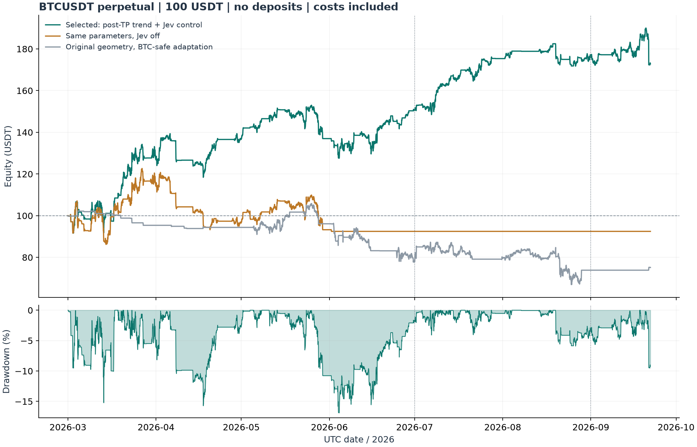

# FMZ古典网格 + NanoJev：BTCUSDT永续调优报告

报告生成：2026-09-23T02:08:46.466628+00:00。所有日期采用UTC。

## 1. 实际结果与适用范围

基于用户提供的FMZ固定锚点策略重新实现并调优后，选中编号为 **1623** 的方案。初始总资金 **100 USDT**、配置杠杆 **10倍**、无中途补入资金，2026-03-01至2026-09-21连续秒级回放后的账户权益为 **172.61 USDT**，净利润 **+72.61 USDT**，净收益率 **+72.61%**，最大回撤 **17.09%**，模拟爆仓 **0次**。

**这是一套在明确模拟假设下的历史正收益参数，不是已证明未来期望收益为正的实盘系统。** 本次能用的完整数据截至9月21日：没有把9月22—30日编入结果，也不能把205天结果称作3—9月完整七个月收益。9月30日相对当前日期仍在未来。

成本压力是当前主要缺陷：手续费加倍且滑点10bp时，净收益变为 **-21.53%**；新闻延迟60秒时为 **-22.06%**。不能只引用基础成本的盈利数值。

当前主方案在单侧止盈后识别趋势，关闭反向持仓并禁止逆势追加；JEV模式为“**方向过滤与对侧退出**”。JEV不会替代保证金和强平检查。“秒级”指每秒回放、决策和事件接入，EMA与网格持仓本身不是几秒内完成的高频交易。



图表从每分钟权益记录中每小时抽取一个显示点；表中最大回撤由撮合过程中更细的标记价路径计算，可能高于图上可见回撤。

## 2. 原策略检查与改造

原文件为`参考内容/FMZ.COM/网格挂单加马丁倍数递增 (滚仓） (回归初心) (双向Origian) (Fiat)(Mulity)(WarningIndex) (Mesh).xml`，源文件SHA256为`8000bfb7b97f7b4c68320d631b5a73ec11cc58939e2addc5a9a3ec73078a60d5`，未改写原文件。详细逐项检查见[源码审查](source_review/review_zh.md)，可读源码副本见[original.js](https://github.com/wikigsroom/Jev-martingale-mesh/blob/ac485d5dbca90ff9ad39df24afc21ba1b90e7562/reports/fmz_v2/source_review/original.js)。

原策略保留部分：双向开仓；每侧固定首次开仓锚点；线性价差的逆势加仓；未取整数量按ratio递增；按全侧均价止盈；另一侧层数过深则限制重新开仓；单侧名义额上限。上一版程序使用的“以上一次加仓价为中心”结构与本文件不同，因此上一轮负收益报告仍保留，不能直接替代本次结论。

模拟实现中修复的关键问题：BTC小额订单在两位小数精度下变成0；多空共用间距导致相互覆盖；拒单仍推进层数；多侧阈值触发后休眠72小时而空侧不对称；清仓后仍沿用旧仓位快照；把可用余额与总权益混用。另发现原码重启后缺失锚点和数量状态；本次模拟从空仓初始化，生产环境的持仓恢复、持久化和异步交易所对账尚未实现。纯JavaScript假的交易接口已复现零数量、负价、拒单推进和72小时休眠，记录在[source_probe.json](source_review/source_probe.json)。

原导出回测实际是ARB_USDT、5000U、20倍杠杆，默认参数还包含30倍杠杆，不能直接移植到BTC/100U。源码的`maxLoss`限制的是**单侧名义仓位/初始本金**，并非真实亏损金额。新版另外实现权益止损和爆仓。原结构对照也经过精度、保证金、硬风险和对称状态修复，因此它不是未经修改的FMZ原码回测。

## 3. 策略如何决策

1. 中性状态下同时建立多、空网格。每侧的锚点和价差独立，最多追加`max_adds`次，且每次需满足已持仓加双方待成交订单的保证金预算。
2. 一侧全部止盈后，使用此前已完成分钟的快速/慢速EMA与最后收盘价判断趋势；EMA相对差达到阈值、收盘方向一致，并持续确认指定分钟数，才转换趋势状态。
3. 确认上行时，关闭剩余空侧，取消逆势加仓；继续开多侧需满足重开等待、新闻闸门、保证金和其他硬风险条件。下行完全对称。进入方向状态后，趋势维持、退出和反转依据相同EMA迟滞规则检查。
4. JEV触发时执行配置的干预。模式1全部平仓并暂停；模式2只有方向偏向达到阈值才退出对侧，否则只限制加仓/重开；模式3只暂停加仓和重开。模式2、3保留未平仓侧的正常止盈，所有模式持续检查硬风险。
5. 当前持仓周期止损、趋势仓止损/跟踪止损、单侧名义上限、账户峰值回撤停机及爆仓检查独立生效；账户停机后不补钱、不重新初始化100U。

“关闭反向仓位”是市价主动平仓，会兑现损失并支付费用；它与保证金不足触发的“爆仓”分开计数。

本次主方案实际有 **80次追加、164次分侧止盈、30次止盈后方向切换、30次趋势驱动反向平仓**。JEV超过阈值的信号为 **836次**，实际JEV双边平仓 **0次**，JEV方向平仓 **1次**。`jev_veto_checks`是每秒条件检查计数，不能当作实际撤销订单笔数。

## 4. 最终参数

完整机器可读参数：[final_parameters.json](final_parameters.json)。初始100U是整个账户资金，不是多、空各100U。

| 参数 | 取值 | 含义 |
| --- | --- | --- |
| `leverage` | 10.0 | 杠杆上限 |
| `gross_utilization` | 0.7 | 权益×杠杆的仓位/挂单预算系数 |
| `base_spacing` | 0.035 | 每侧相对首次开仓价的固定间距 |
| `ratio` | 1.1 | 未取整数量增长系数 |
| `max_adds` | 5 | 每侧最多追加次数 |
| `base_amount_rate` | 0.03 | 动态基础金额/权益 |
| `base_amount_min` | 30.0 | 基础金额下限U（首单再乘ratio） |
| `profit_target` | 0.0175 | 均价±刷新现价×此值止盈 |
| `warning_index` | 99 | 对侧网格序号的重开限制 |
| `max_loss_notional_multiple` | 5.0 | 单侧名义额上限/初始100U |
| `ema_fast_minutes` | 120 | 快速EMA分钟 |
| `ema_slow_minutes` | 240 | 慢速EMA分钟 |
| `trend_enter` | 0.003 | EMA相对差进入阈值 |
| `trend_exit_fraction` | 0.3 | 保持趋势阈值/进入阈值 |
| `trend_confirm_minutes` | 60.0 | 趋势确认分钟 |
| `trend_liquidate_opposite` | true | 确认趋势后关闭反向仓位 |
| `allow_countertrend_add` | false | 允许逆趋势追加 |
| `directional_stop` | 0.01 | 趋势仓相对均价止损 |
| `directional_trail` | 0.07 | 趋势仓相对最佳标记价的回撤止损 |
| `basket_stop` | 0.6 | 当前持仓周期权益止损 |
| `account_drawdown_stop` | 0.25 | 账户峰值回撤停机阈值 |
| `stop_cooldown_minutes` | 0.0 | 风险退出后冷却分钟 |
| `reentry_delay_seconds` | 30.0 | 止盈后该侧最短重开等待秒 |
| `poll_seconds` | 1.0 | 成交后下一组报价最短等待秒 |
| `jev_action` | 2 | JEV干预模式 |
| `jev_breakout_threshold` | 0.25 | JEV短时突破分数阈值 |
| `jev_direction_threshold` | 0.1 | 方向模式的偏向阈值（模式3不使用） |
| `jev_hold_seconds` | 180.0 | JEV干预保持秒 |
| `news_delay_seconds` | 5.0 | 新闻可用时间后的假设延迟秒 |


首单目标美元金额为`max(权益×base_amount_rate, base_amount_min)×ratio`，再满足历史最小名义额与0.001 BTC数量步长；因此实际订单不一定等于理论美元目标。马丁增长作用于未取整数量，实际成交数量会受步长影响出现相邻层同量或更大跳变。挂单预算顺序为多侧后空侧，遵循原程序分支顺序；余额不足时保留止盈，但不假设下一层已成功挂出。

止盈价是`持仓均价 ± 刷新时现价×profit_target`，不是简单的“账户盈利百分比”。`account_drawdown_stop`是硬停机阈值，不能解释为保证最大损失：跳空、滑点和费用仍可穿越阈值。

双边全平模式已实现并参与搜索，但没有同时通过两段秒级正收益、无停机等筛选条件的备选，因此没有把未通过的候选包装为第二套有效参数。

## 5. 时间切分与系统调优

固定随机种子20260924，正式搜索 **3000组不同参数**，覆盖原结构、止盈后趋势控制、持续趋势干预、强趋势暂停网格、仅趋势交易五个控制族，以及三种JEV干预。3—6月有182组分钟级净收益为正，164组进入7—8月验证，10组进一步做两段秒级复核。

选择目标为`0.4×拟合评分 + 0.6×验证评分`，单段评分为`净收益百分比 − 0.5×最大回撤百分比 − 15×停机标记`；要求真实发生追加、足够成交、无爆仓，并对最终候选要求两段正收益且无停机。主候选必须采用止盈后控制及实际触发的JEV策略。单次训练收益最高但验证失败的候选被淘汰，没有将其作为最终参数。

此前几次搜索是同一候选池在撮合修正后的重跑，保留在`search_1/search_2/search_final/search_verified`，**不把重跑次数乘入独立参数数量**。有效最终搜索为`search_margin_verified`，冻结文件记录模型、引擎、数据和参数SHA256。修正包含新下限价单实际可成交时按Taker收费、重开等待、保留保护止盈以及挂单/重开/成交各阶段的保证金预检。

| 编号 | 控制族 | JEV模式 | 3—6月秒级净收益 | 7—8月秒级净收益 | 通过两段条件 |
| --- | --- | --- | --- | --- | --- |
| 290 | 1 | 3 | +27.08% | +35.09% | True |
| 2620 | 0 | 3 | -31.59% | +0.34% | False |
| 310 | 2 | 3 | +21.36% | +19.42% | True |
| 1623 | 1 | 2 | +50.56% | +28.87% | True |
| 1204 | 1 | 2 | +7.17% | +30.38% | True |
| 1244 | 1 | 3 | +16.43% | +25.79% | True |
| 1141 | 1 | 3 | +13.37% | +20.72% | True |
| 1277 | 1 | 3 | +15.82% | +2.54% | True |
| 930 | 1 | 3 | -56.20% | +10.71% | False |
| 2192 | 1 | 1 | +23.95% | -3.36% | False |


| 区间与口径 | 期末权益U | 净收益 | 最大回撤 | 爆仓 | 手续费U | 净资金费U |
| --- | --- | --- | --- | --- | --- | --- |
| 3—6月：拟合区间，独立100U | 150.56 | +50.56% | 17.09% | 0 | 19.41 | -0.60 |
| 7—8月：参与筛选的验证区间，独立100U | 128.87 | +28.87% | 13.27% | 0 | 4.83 | -0.13 |
| 9月1—21日：固定参数诊断，独立100U | 107.50 | +7.50% | 10.53% | 0 | 2.01 | -0.40 |
| 3月1—9月21日：连续单一100U账户 | 172.61 | +72.61% | 17.09% | 0 | 25.46 | -0.63 |


上述独立区间均从100U起算，不能把其利润直接相加、或当作全期账户复利。真正交付的全期结果只初始化一次100U。金融模型在3—5月训练、6月选头与校准，故3—6月属于样本内研究；7—8月参与了参数挑选，也不等于独立检验。9月在此前项目研究中已经看过，虽本轮冻结参数没有用9月收益排名，仍明确称为固定参数诊断，**不是全新未见样本**。

## 6. 对照实验：收益究竟来自哪里

| 配置 | 期末权益U | 净收益 | 最大回撤 | 爆仓 | 手续费U | 净资金费U |
| --- | --- | --- | --- | --- | --- | --- |
| 选中方案 | 172.61 | +72.61% | 17.09% | 0 | 25.46 | -0.63 |
| 同参数关闭JEV | 92.46 | -7.54% | 25.18% | 0 | 13.33 | -0.36 |
| 同参数关闭趋势控制 | 101.98 | +1.98% | 25.27% | 0 | 13.28 | -0.49 |
| 同参数保留反向仓位 | 90.59 | -9.41% | 25.20% | 0 | 4.23 | -0.01 |
| 原结构的BTC安全适配 | 75.01 | -24.99% | 38.73% | 0 | 8.08 | +0.11 |


相同网格和趋势参数，仅开关JEV的全期净利润差为 **+80.15U**。该差是这段模拟路径中的JEV干预增量，包含被干预后后续仓位路径的变化，不能解释为新闻因果效应或稳定统计优势。若关闭JEV更好，应据实承认JEV在此样本中拖累收益，不能因整套策略盈利就宣称模型有效。

| 事件信号对照（其他参数相同） | 全期收益 | 最大回撤 | JEV方向平仓次数 |
| --- | --- | --- | --- |
| 相同JEV触发，关闭方向强制平仓 | +75.58% | 16.73% | 0 |
| 每条新闻固定暂停，无模型评分 | +87.76% | 16.73% | 0 |
| 每条新闻触发，保留模型方向信号 | +84.80% | 17.08% | 1 |

每条新闻都固定暂停的简单规则收益为+87.76%，高于选中JEV方案。即使JEV开关对照表现更好，也不能据此认定模型优于简单新闻暂停；需要同时检查规则对照。此项诊断没有用于重新选参。


关闭趋势控制和关闭反向平仓的两个对照只改变所注明的选项，没有重新调参。它们用于定位主方案收益对逻辑的依赖，不代表相应策略族的最优成绩。JEV双边全平备选若存在，同样提供自己的关闭JEV对照。

## 7. 连续账户分月损益

| 月份 | 月初权益U | 当月损益U | 月末权益U | 当月收益率 |
| --- | --- | --- | --- | --- |
| 2026-03 | 100.00 | +26.81 | 126.81 | +26.81% |
| 2026-04 | 126.81 | +9.92 | 136.73 | +7.82% |
| 2026-05 | 136.73 | +0.24 | 136.97 | +0.18% |
| 2026-06 | 136.97 | +13.75 | 150.73 | +10.04% |
| 2026-07 | 150.73 | +24.63 | 175.35 | +16.34% |
| 2026-08 | 175.35 | +0.91 | 176.26 | +0.52% |
| 2026-09（1—21日） | 176.26 | -3.65 | 172.61 | -2.07% |


每月承接上一月的真实回测权益与持仓，没有月初补入100U。全期最后一秒将剩余仓位按市价成本结算，所以期末数值包括未平仓盈亏兑现和关闭费用。

## 8. 成本、保证金与爆仓模拟

Maker费率为0.020%，Taker为0.050%；主动开平额外滑点2bp；实际历史资金费按结算时间作用于净持仓。主结果累计手续费 **25.46U**，净资金费 **-0.63U**，峰值多空合计名义额 **726.97U**。峰值名义额不能除以初始100U当作当时实际杠杆，因为权益会变化；开仓和挂单预算基于当时权益。

标记价计算的账户权益若不足多空名义额合计×0.40%维持保证金，则先执行模拟强平，另收1.25%强平费，权益下限0，永久停止交易。两侧保证金按总额保守计算，没有对冲减免。风险档位使用当前公开第一档作为历史近似，另提高维持保证金作压力测试。

成交时逐段计算普通止损和强平障碍；跳空先检查爆仓，再检查普通退出。合成多空不等仓位与±5%至±50%跳空的诊断中，**2个情景实际触发爆仓**，证明系统没有将爆仓路径过滤掉。这些是特意构造的库存快照，不声称策略实际持有过该快照。

已持仓和双方下一层挂单共同占用预算；重新开仓不能花掉其他挂单预留保证金。价格波动后若预算不再满足，模拟本地撤销/拒绝该次追加，稍后重新报价，不能假装旧单仍可按Maker成交。`local_margin_rejections`是本地预检失败次数，不是实际发送给交易所的拒单次数。

限价要求成交价穿越报价；新限价若立即可成交则按Taker及限价边界收费。秒内分别模拟O-H-L-C和O-L-H-C并选择当秒较低权益分支作为压力假设；这不是实际逐笔路径，也不是数学上保证全期最差的收益下界。每侧每秒最多一笔追加，成交后等待下一次报价周期。

**秒级标记价是近似值**：当秒成交价乘上一根完整分钟的标记价/成交价比率。官方1分钟真实标记价复核的主方案净收益为 **+42.25%**，最大回撤 **24.35%**，爆仓0次。1分钟同时改变撮合粒度，因此它是另一个检查场景，不能作为精确秒级强平轨迹证明。

## 9. 参数固定后的压力与邻域检查

| 全期固定参数压力情景 | 期末权益U | 净收益 | 最大回撤 | 爆仓 |
| --- | --- | --- | --- | --- |
| Maker/Taker手续费均加倍 | 79.47 | -20.53% | 25.56% | 0 |
| 所有成交按Taker费率收费 | 80.69 | -19.31% | 25.28% | 0 |
| 市价滑点10bp | 79.21 | -20.79% | 25.17% | 0 |
| 手续费加倍且市价滑点10bp | 78.47 | -21.53% | 25.62% | 0 |
| 维持保证金率提高到1% | 172.61 | +72.61% | 17.09% | 0 |
| 新闻延迟30秒 | 172.92 | +72.92% | 17.09% | 0 |
| 新闻延迟60秒 | 77.94 | -22.06% | 25.23% | 0 |
| 新闻延迟300秒 | 83.99 | -16.01% | 25.31% | 0 |
| 成交后报价等待2秒 | 172.64 | +72.64% | 17.08% | 0 |
| 成交后报价等待5秒 | 172.66 | +72.66% | 17.08% | 0 |
| 每秒OHLC先高后低 | 172.61 | +72.61% | 17.09% | 0 |
| 每秒OHLC先低后高 | 172.61 | +72.61% | 17.09% | 0 |


上述12个全期秒级场景中，6个净收益仍为正。新闻延迟只延后同一已产生模型信号，不输入延迟之后的新行情重新预测。报价等待测试只模拟成交后改单周期，不能代表真实网络排队、订单确认或交易所故障。

进一步将7个已通过基础成本秒级复核的候选做同样高成本筛选，要求3—6月、7—8月分别盈利且不触发停机/爆仓；通过者为0个。这轮也未利用9月收益挑参数。

| 候选编号 | 高成本3—6月收益 | 高成本7—8月收益 | 通过条件 |
| --- | --- | --- | --- |
| 290 | -41.50% | +24.40% | False |
| 310 | -1.77% | +6.32% | False |
| 1623 | -21.53% | +30.02% | False |
| 1204 | -33.21% | +13.93% | False |
| 1244 | -30.06% | +17.01% | False |
| 1141 | -64.38% | -0.97% | False |
| 1277 | -31.52% | -6.32% | False |

因此，本次交付的是基础成本假设下的历史盈利解，尚未找到在这组更高成本下同时通过两段检查的稳健解。不能将主方案描述为已经适合实盘。


下表单项修改20个邻域配置，仅作冻结后的敏感性诊断，未据9月或这些结果改选最终参数。它们使用1分钟成交及真实标记价，不能与秒级主收益直接比较；14/20个全期邻域为正。

| 单项扰动 | 3—8月1分钟净收益 | 全期1分钟净收益 | 全期最大回撤 |
| --- | --- | --- | --- |
| base_spacing_x0.9 | -12.40% | -12.40% | 25.18% |
| base_spacing_x1.1 | -22.17% | -22.17% | 25.47% |
| profit_target_x0.9 | -20.66% | -20.66% | 25.38% |
| profit_target_x1.1 | +78.15% | +87.98% | 22.84% |
| trend_enter_x0.9 | +30.34% | +31.04% | 24.90% |
| trend_enter_x1.1 | -10.92% | -10.92% | 25.07% |
| directional_stop_x0.9 | -14.07% | -14.07% | 25.36% |
| directional_stop_x1.1 | -3.36% | -3.36% | 25.14% |
| directional_trail_x0.9 | +44.71% | +42.25% | 24.35% |
| directional_trail_x1.1 | +44.71% | +42.25% | 24.35% |
| ratio_-0.05 | +44.71% | +42.25% | 24.35% |
| ratio_+0.05 | +44.71% | +42.25% | 24.35% |
| jev_threshold_-0.02 | +44.71% | +42.26% | 24.37% |
| jev_threshold_+0.02 | +45.02% | +42.56% | 24.11% |
| jev_hold_x0.5 | +55.12% | +52.66% | 20.28% |
| jev_hold_x2.0 | +57.06% | +54.59% | 20.74% |
| poll_2s | +44.71% | +42.25% | 24.35% |
| poll_5s | +44.71% | +42.25% | 24.35% |
| smaller_budget | +55.53% | +53.08% | 22.50% |
| one_fewer_add | +44.71% | +42.25% | 24.35% |


## 10. 新闻、行情与NanoJev的证据边界

行情为Binance官方BTCUSDT USDT本位永续公开归档：205天、293,759,548笔聚合成交、17,712,000根1秒K线，以及295,200根1分钟成交/标记价K线。原ZIP及校验记录保留。资金费来自3—8月官方归档及9月公开REST，未用固定费率替换缺失记录。无成交秒采用此前已知价格，未用未来成交回填。

新闻为Bitcoin Magazine公开WordPress接口：983条原记录，976条具有完整标签输入；当前只有一个媒体源。可用时间采用`max(发布时间, 修改时间)+5秒`，文本是事后抓取，缺乏历史真实接收日志。因此不能声称秒级收到同样新闻，更不能推断对所有交易所公告、宏观新闻或社交平台的覆盖率。

模型为真实`C-Tianyu/NanoJev unified-games-v1`，骨干Qwen3-0.6B，采用原始候选选择头结构，冻结骨干后训练金融头。原始项目用于候选行动判断，原权重不是金融交易模型。金融目标是从当时已知新闻和完成行情判断未来30秒收益属于上涨、区间或下跌；阈值为`max(0.03%, 历史30分钟的一分钟收益标准差×sqrt(0.5))`。`p_up+p_down`是短时越阈值代理，非爆仓概率、新闻因果效应、策略胜率或持仓退出价值。

9月95条事件，模型准确率78.95%，简单类别频率基线78.95%；模型Log loss 0.6813，基线0.6682，越低越好。**现有样本没有证明该模型的金融预测优于简单基线。** 本机RTX3060已验证预热后单条含分词推理约106ms，但不包含消息发布/接收、网络和真实交易执行时间。模型检查点事后取得，也不能证明其在历史窗口起点即可部署。

没有历史盘口队列、成交优先级、部分成交深度、网络中断或新闻源掉线重放。实际接入交易所前需补充这些证据；现有程序不连接真实下单账户。29项测试覆盖锚点、分侧状态、拒单不推进、保证金预留、止盈后反向退出、JEV保留保护单、费用守恒与跳空爆仓。

## 11. 收益预估：仅可给出有条件的样本情景

上述 **+72.61%** 是205天历史模拟的净收益，不能线性外推为月收益承诺。为满足收益预估的数量表达，使用选中参数7—8月62个日收益做3日连续块重采样，得到10,000条30日情景。100U在这些样本条件下的期末权益均值 **113.36U**、中位数 **113.04U**，5%—95%分位 **99.06—128.56U**。

这不是未来收益置信区间。7—8月参与了选参，分布本身带有选择偏差；重采样没有重新执行最小订单档位、保证金和持仓状态，也没有模拟新市场环境。**无法据此识别真实未来盈利概率或给出可靠的前瞻期望收益点估计。** 这份报告的可交付结论是已复现的历史正收益和压力测试范围。

## 12. 程序、参数及复现

- [完整参数](final_parameters.json)、[选择冻结与哈希](selection_freeze.json)、[全部评估指标](evaluation.json)。
- [3000组试验记录](search_margin_verified/trials.csv)、[秒级候选复核](confirmed_candidates.json)、[每月连续损益](monthly_continuous.csv)。
- `full_1s_selected_equity.csv`为每分钟末权益；`full_1s_selected_decisions.csv`为发生成交、方向变化或事件触发的**秒级汇总轨迹**，不是交易所逐订单成交回执。最终强制结算包含在指标和权益中，未单独写成轨迹行。
- `src/jevmesh/fmz_engine.py`与`fmz_config.py`为本次固定锚点策略及风险实现；`model_runtime.py`用于真实NanoJev单条事件评分，`guard.py`用于撤单、双侧退出及暂停意图管理。

在项目根目录原生PowerShell执行：

```powershell
python -m pytest -q
python scripts/run_fmz.py --resolution 1s --start 2026-03-01 --end 2026-09-22 --out reports/fmz_v2/reproduce
python scripts/run_fmz.py --variant no_jev --out reports/fmz_v2/reproduce_no_jev
```

完整调优流程：`tune_fmz.py → confirm_fmz.py → evaluate_fmz.py → build_fmz_report.py`。日期结束边界不包含该日；重新运行选参会重写本目录结果，当前冻结记录应保留后再开始新实验。

全程使用原生Windows Python/Node，未启动Docker、WSL或其他虚拟化环境；未发送真实交易订单。没有调用交互浏览器产生额外标签页。

## 13. 原始依据

- [FMZ账户字段](https://www.fmz.com/syntax-guide/struct/account)、[GetAccount](https://www.fmz.com/syntax-guide/fun/account/exchange.getaccount)、[持仓方向常量](https://www.fmz.com/syntax-guide/var/position_direction)、[订单字段](https://www.fmz.com/syntax-guide/struct/order)。
- [NanoJev原始项目](https://github.com/TianyuCodings/NanoJev)、[公开模型权重](https://huggingface.co/C-Tianyu/NanoJev)。
- [Binance官方归档说明](https://github.com/binance/binance-public-data)、[BTCUSDT最小名义额调整公告](https://www.binance.com/en/support/announcement/detail/10999fd17dc045de801c0c78ab29e6fc)、[标记价与强平说明](https://www.binance.com/en/support/faq/detail/b3c689c1f50a44cabb3a84e663b81d93)、[公开风险阶梯](https://www.binance.com/bapi/futures/v1/friendly/future/common/brackets)。
- [Bitcoin Magazine新闻接口](https://bitcoinmagazine.com/wp-json/wp/v2/posts)。
