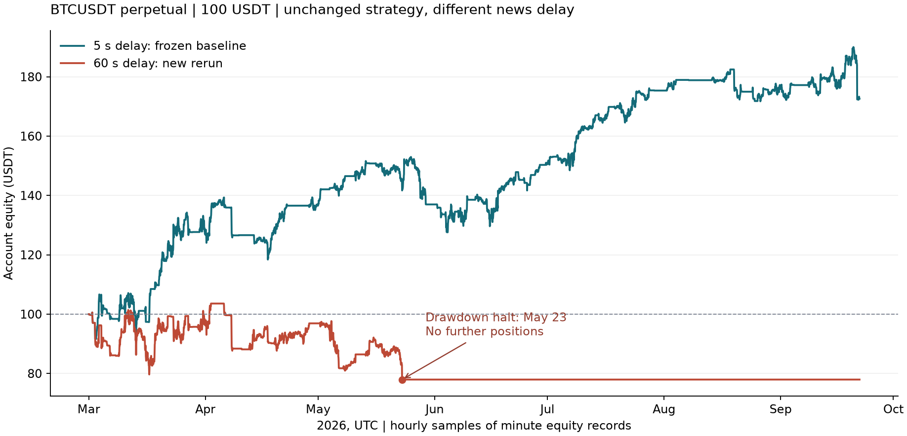

# 新闻模拟延迟60秒：独立复跑记录

记录编号：FMZ-JEV-20260923-L60。基于R1候选1623，仅将新闻模拟接收延迟从5秒改为60秒；不重新训练或调参。结果为 **100 USDT → 77.9442 USDT，净收益-22.0558%**，触发账户回撤停机。

## 范围与口径

BTCUSDT USDT本位永续，UTC 2026-03-01 00:00:00至2026-09-21 23:59:59，共205个完整日、17,712,000根秒线。单一账户初始总权益100U，最高10倍杠杆。网格、马丁追加、趋势控制、JEV干预模式、费用、资金费、滑点及爆仓模拟均与R1相同。

新闻源仍为Bitcoin Magazine。模拟到达时间为 `max(published_ms, modified_ms) + 60000`，不是原5秒再增加60秒。本次复用原JEV分数缓存：这些输入以+5秒时点构造；延后到+60秒交付给策略，未在+60秒重新收集行情特征或推理。这检验旧信号晚到的影响。模型原标签为+5秒后未来30秒的价格分类，执行时已超过其原预测窗口，不能把本试验解释为“用+60秒最新信息重新预测未来30秒”。

## 与5秒基线对比

| 指标 | 5秒，R1已冻结结果 | 60秒，本次重新执行 |
| --- | ---: | ---: |
| 期末权益 | 172.6141 U | 77.9442 U |
| 净损益 | +72.6141 U | -22.0558 U |
| 净收益率 | +72.6141% | -22.0558% |
| 最大回撤 | 17.0864% | 25.2317% |
| 手续费 | 25.4605 U | 13.1654 U |
| 净资金费 | -0.6333 U | -0.3485 U |
| 模拟成交次数 | 562 | 220 |
| 马丁追加次数 | 80 | 30 |
| 止盈成交次数 | 164 | 66 |
| JEV强制单侧平仓 | 1 | 0 |
| 模拟爆仓次数 | 0 | 0 |
| 账户回撤停机 | 否 | 是 |

收益差为 **-94.6699个百分点**。60秒复跑的全部指标与R1已有60秒压力测试逐项一致。5秒列引用已校验哈希的原结果，不是本次另行重跑。



## 停机与分月损益

最后平仓在 **2026-05-23 07:50:51 UTC**，即台北时间 **2026-05-23 15:50:51**。当时剩余0.005 BTC多仓被关闭，之后到9月21日保持空仓和固定权益。依据是最终停机标志、爆仓计数为0、该秒平仓轨迹以及后续全期空仓；原轨迹不单独记录逐秒HALT标志。停机来自25%账户峰值回撤阈值，平仓成本使最终记录的最大回撤达到25.2317%。

| 月份UTC | 月初权益U | 月净损益U | 月末权益U | 月收益率 |
| --- | ---: | ---: | ---: | ---: |
| 2026-03 | 100.0000 | -3.7410 | 96.2590 | -3.7410% |
| 2026-04 | 96.2590 | +0.6309 | 96.8900 | +0.6554% |
| 2026-05 | 96.8900 | -18.9457 | 77.9442 | -19.5539% |
| 2026-06 | 77.9442 | +0.0000 | 77.9442 | +0.0000% |
| 2026-07 | 77.9442 | +0.0000 | 77.9442 | +0.0000% |
| 2026-08 | 77.9442 | +0.0000 | 77.9442 | +0.0000% |
| 2026-09 | 77.9442 | +0.0000 | 77.9442 | +0.0000% |

这是连续账户结果，6月至9月的零损益来自已经停机，不能解释为这些月份重新投入100U的独立收益。全期836次达到阈值的新闻触发包含停机后的事件计数，也不等于836次实际交易干预。

## 判断与证据边界

在本次60秒延迟设定下，原参数组合没有保持正收益，不能沿用5秒延迟的+72.61%作为这一设定的成绩。延迟改变新闻干预窗口与后续持仓路径，账户于5月触发停机。本次没有重新搜索60秒条件下的盈利参数。

仍沿用R1的历史新闻时间代理与秒级标记价近似；没有历史实收时间、盘口排队或部分成交数据。零次模拟爆仓只是本路径结果。3—6月涉及样本内研究，9月此前已观察，本次不是新的未见样本验证，也不是未来收益预测。

## 复现与文件

- [本次60秒参数](parameters.json)
- [本次完整指标](full_1s.json)
- [机器可读对比](comparison.json)
- [逐日权益及损益](daily_continuous.csv)、[分月汇总](monthly_continuous.csv)
- [完整分钟权益与秒级动作轨迹压缩包](trajectories.zip)
- [本次运行清单](run_manifest.json)、[结果核对](audit.json)

原生Windows PowerShell，在项目根目录执行：

```powershell
python -X utf8 scripts/run_fmz.py --params reports/fmz_v2/news_delay_60s_20260923/parameters.json --resolution 1s --start 2026-03-01 --end 2026-09-22 --out reports/fmz_v2/news_delay_60s_20260923/reproduce_60s
```

命令直接重算指标并写出权益CSV和动作CSV，需要本地已有处理数据。结束日期不包含2026-09-22。原R1参数、报告、评估JSON和归档保留原值；本记录单独保存60秒设定与负收益结果。
